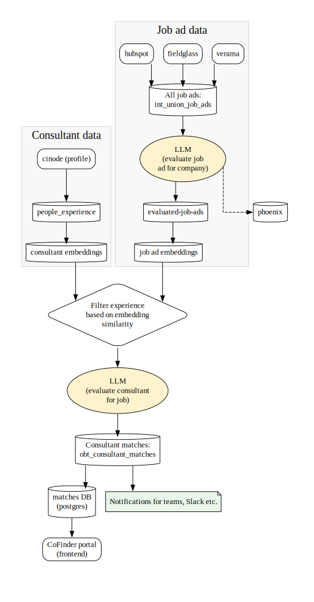

CoFinder is a system designed to automate the process of identifying relevant job ads for different Knowit organisations and matching them with the most suitable consultants. The fundamental idea is to gather job advertisements from various external sources, such as Verama, Fieldglass, and HubSpot, and integrate this information with our consultants' professional profiles and experiences retrieved from Cinode. By connecting opportunities with internal talent, CoFinder aims to streamline business development, allowing the company to quickly identify which relevant job ads have been posted and which specific consultants are well-suited for them.

At the heart of CoFinder is a data pipeline orchestrated using Dagster. The
first main step involves ingesting, cleansing, and consolidating all job
advertisements into a unified data store. These jobs are then subjected to an
evaluation process where they are ranked for relevance to the company.
Simultaneously, consultant data from Cinode representing individual skills and
experiences is processed and run through an embedding model. The final step
involves matching the relevant job ads against the consultant profiles,
generating a rank for each consultant/job pairing. The resulting matches and
detailed data are loaded into a database and made available for review and
action via the CoFinder Portal. See *Figure 1* for a schematic of the data flow
in the main pipeline.

*Figure 1: A schematic of the data flow in the CoFinder system. Only the most central assets have been named in the diagram.*

Below, each stage is explained in more detail.

## Job ad data ingestion

The job ad ingestion process begins by fetching advertisements from various
external sources, including Verama and Fieldglass. This data is extracted using
DLT assets for some sources and Python assets for others, and then cleansed and
transformed using dbt. The data is further enriched, for example by adding
geographic locations to each ad, before all input is consolidated into a unified
intermediate table, *int_union_job_ads*. This unified table then flows into the
next step: match evaluation by the Large Language Model (LLM).

## Job ad matching 

The LLM evaluation process takes the consolidated job ads and determines their
relevance to each onboarded Knowit organisation separately using the prompts
stored in *stg_company*. This function is handled by an asset that queries an
LLM, with the company prompt as system instructions and the job ad as the user
input. The LLM assigns a rank from 0 to 10 and provides a motivation for that
rank, adding these details as columns to the resulting *int_evaluated_job_ads*
table. The LLM call stacks are tracked using **Phoenix**.

## Consultant data ingestion

The consultant skills and experiences are imported from their Cinode profile and saved in *int_people_experience*. The pipeline only draws from the data in the profile section, not from targeted CVs. 

## Embeddings

The tables *int_evaluated_job_ads* and *int_people_experience* are converted
into embedding space and saved to **LanceDB**. For consultant experience, the
English language version is used when available; otherwise Swedish, then other
languages. For job ads, the language of the source ad is used.
The embedding model used is **mixedbread-ai/mxbai-embed-large-v1**.

Note: the current embedding model is English-only. If match quality becomes a
priority area, translating all content to English first or switching to a
multilingual embedding model would likely improve retrieval quality.

## RAG + consultant matching

For all ads that received a rank above 0 in the job ad evaluation step, each
consultant for the company in question is run through RAG plus consultant
matching. In the retrieval step, the most similar experience embeddings are
retrieved for the job ad embedding, and the corresponding consultants are
selected for evaluation. The exact retrieval count should be documented from the
current implementation rather than guessed here.

In consultant matching, an LLM call is made with the job ad, consultant skills,
and the prompt found in
*datadrivet-infra-opendatastack/processing/prompts/knowit_consultant_matcher_msg.txt*.
Each evaluated consultant receives a rank from 1 to 10 indicating their
suitability for the assignment, together with a motivation for that rank.

## Output

The output from consultant matching step is saved in *obt_consultant_matches*. This table is then used as a source for sending notifications to channels like Slack and Teams, and is synced to a table called "matchingconsultants" in a **Postgres** database used for displaying the data in the CoFinder portal.
