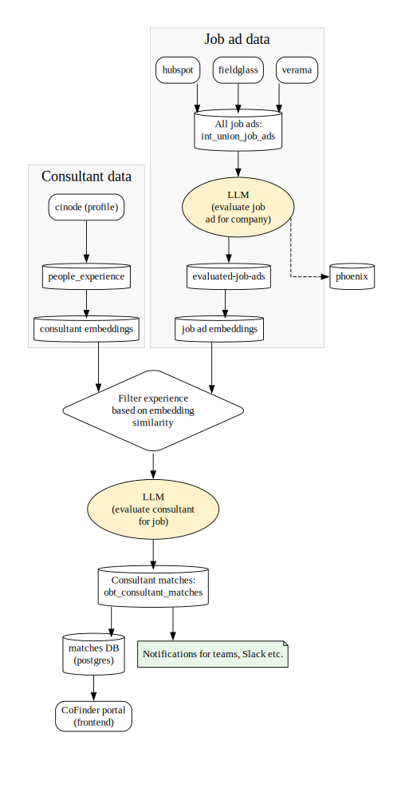

CoFinder is a system designed to automate the process of identifying relevant job ads for different Knowit organisations and matching them with the most suitable consultants. The fundamental idea is to gather job advertisements from various external sources, such as Verama, Fieldglass, and HubSpot, and integrate this information with our consultants' professional profiles and experiences retrieved from Cinode. By connecting opportunities with internal talent, CoFinder aims to streamline business development, allowing the company to quickly identify which relevant job ads have been posted and which specific consultants are well-suited for them.

The system achieves this through a structured data pipeline managed primarily using Dagster. The first main step involves ingesting, cleansing, and consolidating all job advertisements into a unified data store. These jobs are then subjected to an evaluation process where they are ranked for relevance to the company. Simultaneously, consultant data from Cinode which represent individual skills and experiences is processed and run through an embedding model. The final step involves matching the relevant job ads against the consultant profiles, generating a rank for each consultant/job pairing. The resulting matches and detailed data are loaded into a database and made available for review and action via the CoFinder Portal. See *Figure 1* for a schematic of the data flow in the main pipeline.

*Figure 1: A schematic of the data flow in the CoFinder system. Only the most central assets have been named in the diagram.*

Below, each stage is explained in more detail.

## Job ad data ingestion

The job ad ingestion process begins by fetching advertisements from various external sources, including Verama and Fieldglass. These data are ingested, cleansed, and massaged using a combination of **dbt** and **Dagster**. The data are further enriched e.g. by adding geographic locations to each ad before all input is consolidated into a unified intermediate table *int_union_job_ads*. This unified table then flows into the next step: match evaluation by the Large Language Model (LLM).

## Job ad matching 

The LLM evaluation process takes the consolidated job ads and determines their relevance to each onboarded Knowit organisation separately using the prompts stored in *stg_company*. This function is handled by an asset that queries an LLM, with the company prompt as "system instructions" and the job ad as the "user input". The LLM assigns a rank (a score between 0-10) and provides a motivation or explanation for that rank, adding these details as columns to the resulting *int_evaluated_job_ads* table. The LLM call stacks are tracked using **Phoenix**.

## Consultant data ingestion

The consultant skills and experiences are imported from their Cinode profile and saved in *int_people_experience*. The pipeline only draws from the data in the profile section, not from targeted CVs. 

## Embeddings

The tables *int_evaluated_job_ads* and *int_people_experience* are converted into embedding space and saved to **LanceDB**. For consultant experience, if English language version exists, this is used for embeddings. If not, then Swedish, then other languages. For job ads, the language of the job ad is used. 
The embedding model used is **???**.

**Improvement suggestion**: The used embedding model is English-only. To improve embeddings and increase the quality of matches in the RAG step, translating all content to English first or using a multi-language embedding model would be preferable.

## RAG + consultant matching

For all companies that received a rank above 0 in the job ad matching step, each consultant is run through RAG +consultant matching. In the RAG step, **200?????** most relevant chunks of each consultant's experience are selected based on embedding similarity. 

In consultant matching, an LLM call is made with the job ad, consultant skills and the prompt found in *datadrivet-infra-opendatastack/processing/prompts/knowit_consultant_matcher_msg.txt*

## Output

The output from consultant matching step is saved in *obt_consultant_matches*. This is then further used as a source for **Postgres** database called "matches" and to send notifications to channels like Slack and Teams.
